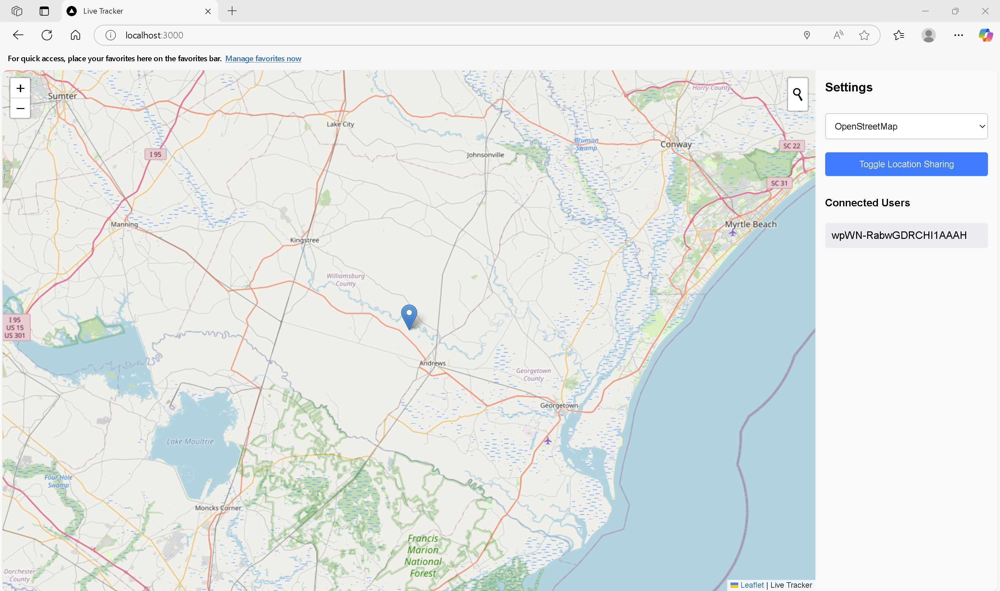
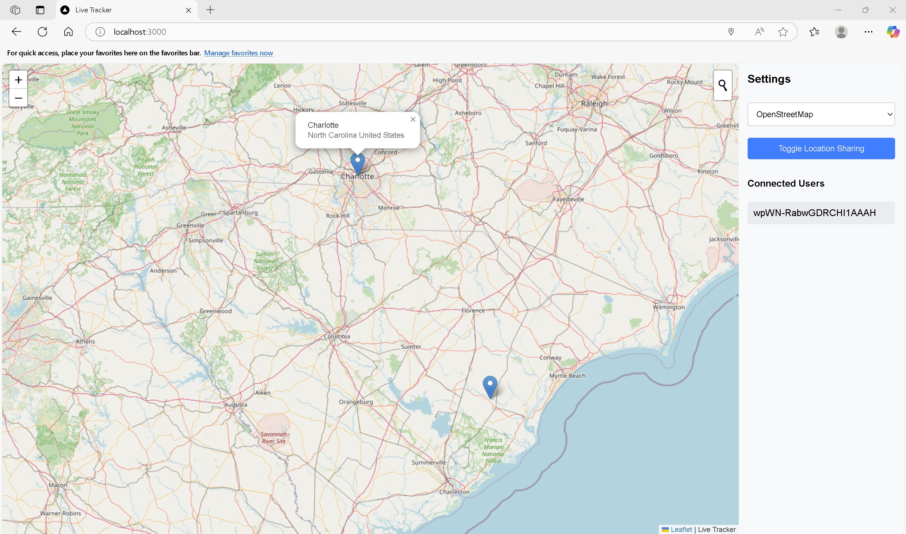

# Live-Tracker

- A real-time location tracking web application built with Node.js, Express.js, Socket.io, and Leaflet.js. 
- This app enables users to share and view live GPS locations on an interactive map. 
- It features a seamless user experience for real-time location updates, with a focus on simplicity, performance, and scalability.

# Live Link:
https://live-tracker-06hi.onrender.com/

## Screenshot:

Provides location of user in real-time using socket io and leaflet js


We can search locations:
Example: I typed Charlotte, NC. The map will zoom to the desired area.


# Table of Contents

## Project Overview

- Live Tracker is a web application that allows users to share their real-time location with others. 
- Built with Node.js and Socket.io, the app uses WebSockets to broadcast location updates to all connected clients in real time. 
- Leaflet.js powers the interactive map that displays user locations. 
- The project demonstrates key concepts in real-time communication, location-based services, and modern web development practices.

Real-time location sharing with multiple users.
Interactive, client-side map visualization using Leaflet.js.
Geolocation API for tracking and displaying user locations.
Socket.io for bi-directional communication between the server and clients.
Scalable architecture for handling multiple users and real-time data updates.


## Features:

- Real-time location updates: Users can view each other's live GPS locations as they move.
- Location sharing toggle: Users can start or stop sharing their location with others using a simple button.
- Interactive map: Uses Leaflet.js to display users' locations on a map, with customizable tiles and geocoder support.
- Connected Users List: Displays a list of users who are currently online and sharing their location.
- Responsive design: Works seamlessly on both desktop and mobile devices.
- Error handling: Properly handles geolocation errors (e.g., permission denial, timeout, unavailable location).


## Technologies Used:

- Node.js: JavaScript runtime for building the server-side application.
- Express.js: Web framework for handling HTTP requests and middleware.
- Socket.io: Library for enabling real-time, bidirectional communication   between the server and clients.
- Leaflet.js: Open-source JavaScript library for interactive maps.
- Geolocation API: Used to obtain real-time user locations from their device.
- EJS (Embedded JavaScript): Templating engine for rendering dynamic HTML content.
- CSS/HTML: For styling and structure of the web application.


### Installation

- Prerequisites
Node.js (v14 or higher)
npm (Node Package Manager)


Clone the repository with
```bash
git clone https://github.com/rampalliprakhar/Live-Tracker
```

### Navigate the directory
```bash
cd Live-Tracker
```

### Install dependencies
```bash 
npm i
```

### Run it 
```bash  
npm run dev 
```

Open http://localhost:3000 with your browser to see the application

## Usage Instruction
Once the app is up and running, follow these steps to start using it:

- Start location sharing: Click on the "Toggle Location Sharing" button to start sharing your location with others. 
  The app will request access to your device's GPS.
- View other users' locations: As other users connect and share their location, you'll see their markers update in real-time on the map.
- Stop location sharing: Click the "Toggle Location Sharing" button again to stop sharing your location.

Key features include:

- Real-time updates: Users' locations are displayed as they move.
- Connected Users list: Displays the IDs of users who are currently sharing their location.
- Interactive map: Users can zoom in/out, pan, and search for locations using the built-in geocoder.

## Project Structure:
```bash
/live-tracker
  ├── /node_modules             # Node.js dependencies
  ├── /public                   # Public files (CSS, images, JS)
  │   ├── /css                  # Styles for the app
  │   ├── /js                   # Client-side JavaScript
  ├── /views                    # EJS views
  ├── /server.js                # Main server entry point
  ├── /package.json             # Project dependencies and metadata
  └── /README.md                # Project documentation (this file)
```
- server.js: This is the entry point for the backend. It initializes the Express.js server and sets up Socket.io for real-time communication.
- public/js/script.js: Client-side JavaScript that interacts with the Socket.io server, handles geolocation, and updates the map.
- public/css/style.css: The app's CSS styles for layout, map, and UI components.
- views/index.ejs: HTML structure for the app's front-end, including the map and UI elements.

## Acknowledgements:
Leaflet.js: For providing the interactive map visualization.
Socket.io: For enabling real-time, bidirectional communication.
Node.js: For providing the JavaScript runtime on the server.
Express.js: For simplifying the server-side development and routing.
Geolocation API: For enabling access to user device locations.
