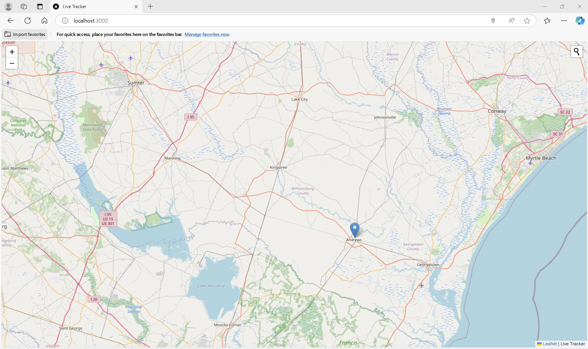
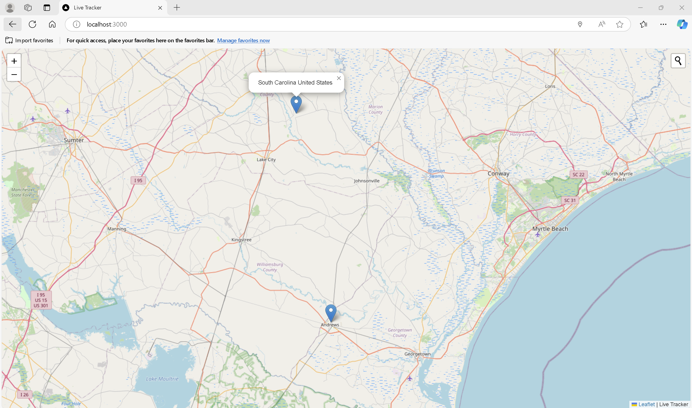

# Live-Tracker
A real-time location map created using leaflet js, an open-source Javascript library, and node-express js for the socket server (Socket.io). This map gives real-time location, and we can use the Leaflet js libraries to search for desired locations.

## Getting Started

### Installation
Clone the repository with
```bash
git clone https://github.com/rampalliprakhar/Live-Tracker
```

### Navigate the directory
```bash
cd Live-Tracker
```

### Install dependencies
```bash 
npm i
```

### Run it 
```bash  
npm run dev 
```

Open http://localhost:3000 with your browser to see the application


## Features:
## Real Time Location:

    Provides real time location using geolocation.

    Connects the client-server using socket.io library for location of user in real time.

    Utilizes leaflet js an open-source library for mobile-friendly interactive maps. 

## Example:

Provides location of user in real-time using socket io and leaflet js


We can search locations:
Example: I typed Florence, SC. The map will zoom to the desired area.
